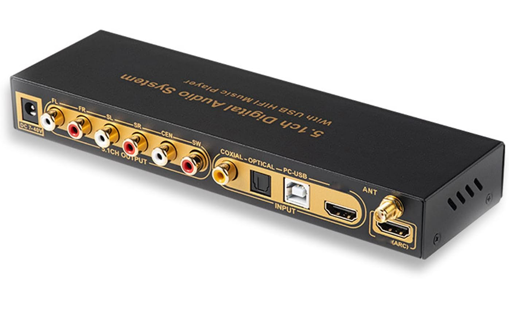
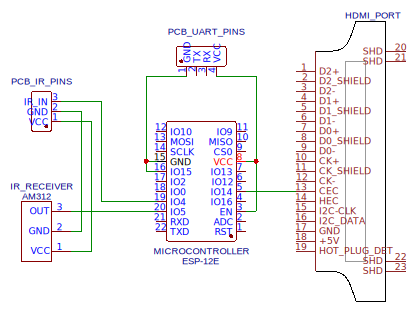
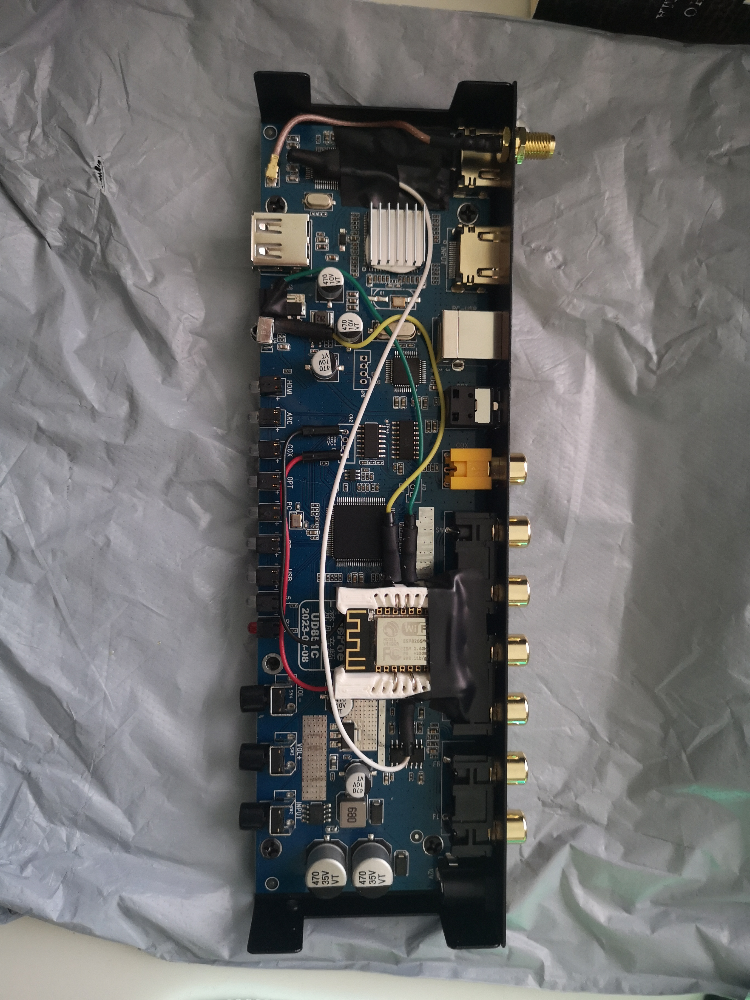
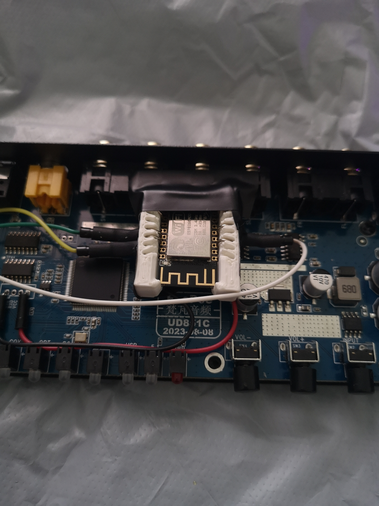
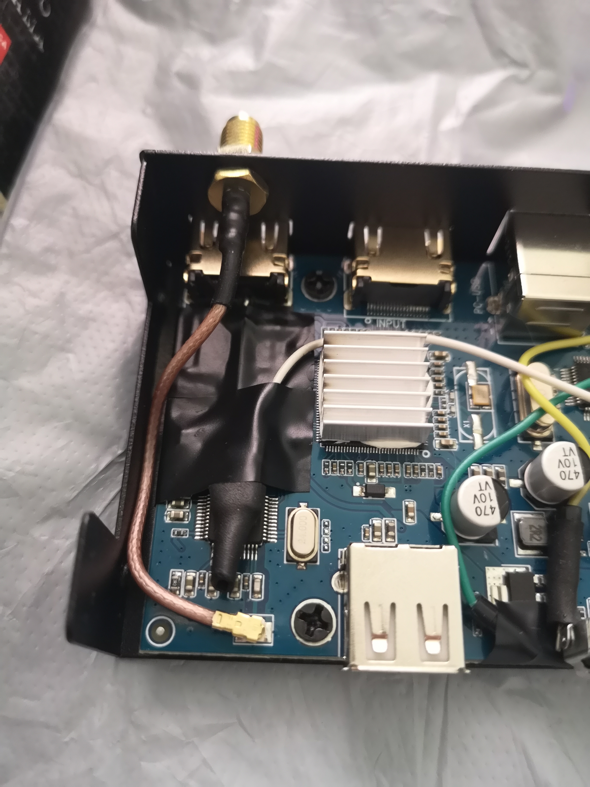
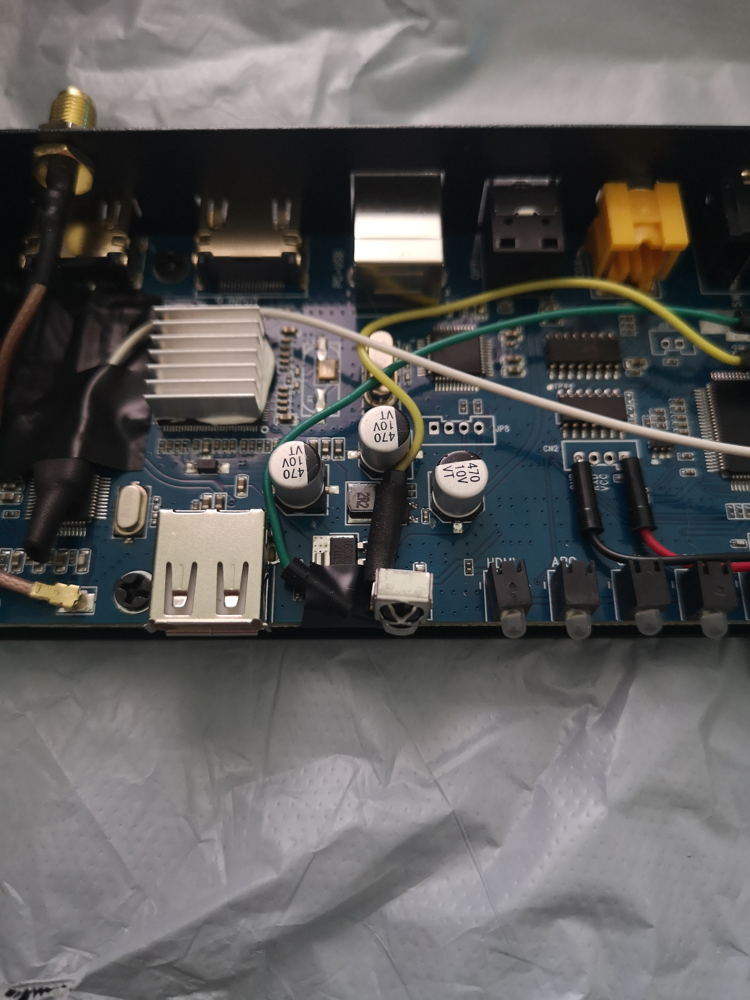

# TinyAVR

## Background

Some years ago, I invested into some high-quality speakers from Teufel. It is a 5.1 setup based around the Teufel US 2110/6, which is an active subwoofer that powers all the speakers. Since I used this system mainly with a PC, I had no problem with the all-analog 6-channel inputs. But to use it in combination with my new digital-only TV requires some kind of AV-Receiver to handle, decode and pass the encoded surround signals to the 6 analog channels of the subwoofer. Since I only want to use HDMI ARC as the audio source and since I don't need many configuration options, a full-size AVR is too much, too expansive and also too large to fit the aesthetics of my living room. Therefore, I went the cheap way and modified a no-name small receiver to fit my needs.

## The UD851B

I ordered this device for 42€ from AliExpress. It has some amazing features for its small price:

- Various Inputs (**ARC**, HDMI, Optical, Coaxial, PC-USB and Bluetooth!)
- 5.1 decoding and multiple optional downmix modes
- 6 channel RCA outputs
- A very small form factor
- A remote to control everything (that I wanted to get rid of anyway)

The Problem:

It perfectly handles ARC audio, but it doesn't react to HDMI CEC volume commands, which requires me to use 2 remote controls, which I definitely don't want to do.
But since it was such a bang for the buck, I thought I could add this functionality by myself!

## How I created a smart TinyAVR

The plan was quite simple:

- Use an ESP8266 with a HDMI CEC library
- Connect pin 13 of the HDMI port (the CEC pin) to a digital input pin of the ESP
- Listen for VOL UP, VOL DOWN, and MUTE commands
- "press" the corresponding button on the receivers remote

But instead of adding an IR emitter to the ESP, I desoldered the IR receiver from the device and attached a direct connection from an ESP digital output pin to the IR signal pin on the PCB. This way, I can just simulate every IR command directly from the ESP.\
Additionally, I soldered the IR receiver to the ESP too. This way, I can still receive the IR commands from the original remote and pass them through the ESP to the receiver.

Using this approach, I could fix the HDMI CEC problem while even making the whole device smart since I can now virtually press every button through the ESP using, for example, Home Assistant.

## Schematic

## Result

## Why I would not recommend it

At first, I thought this solution worked great, but after a few days I found a some flaws.

### 1. Mapping of Streaming Audio

For some reason, the audio mapping of all streaming providers is terrible. It sounds worse than with the TV speakers. Surprisingly, YouTube does not have this problem - everything sounds good and the channels are perfectly mapped and balanced.\
Maybe it has to do with a codec that the streaming providers use that isn't handled correctly by the TinyAVR.

### 2. 5.1 Volume Control is weird

The volume control is just unpredictable. I have buttons to control the volume of every channel, but somehow they influence each other, and sometimes they just do nothing.\
This only happens for 5.1 volume control. When I set it to 2.0 channels, the volume control works great.

### 3. HDMI CEC decoding is flaky

Sometimes I can't control the volume because the ESP can't decode the HDMI CEC commands. I didn't have time to dive deeper into the reason why this happens, but I can still control the volume over Home Assistant, which means it's a CEC problem. Probably some kind of interference or a soldering mistake - maybe a pin is bridged - this was my first time soldering onto such tiny legs.

## Conclusion

For now, I dropped this project because of the mentioned problems. Some of them are probably fixable, but only with much more investigation, which is why I will look out for an alternative solution 👀.